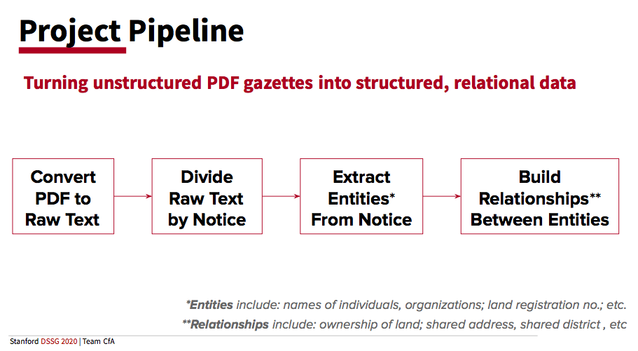

# dssg-cfa-public

## Introduction

This Github repository was completed by a team of fellows as part of Stanford's Data Science for Social Good program in the Summer of 2020, working on a project originated by Code for Africa and the World Resources Institue. The end goal of our project is to create high quality and easily accessible relations datasets concerning land-related information from the Kenya Gazettes, aiming to help journalists uncover land corruption and protect natural resources. You can read our final report [here](insert_link) and watch our final presentation [here](insert_link).

Our outputs are: 
1. A dataset of higher quality PDF-to-text translations of Kenya Gazettes.
2. A beginning dataset of entities extracted from 2000-2019 land records (names, addresses, land plots, etc.), stored in a data schema comparable to that already implemented within Aleph, CfA’s data journalism platform. 
3. A network of these entities. 

## Status

This project is currently in prototype form. While the pipeline works from start to finish, there are numerous it can be improved and extended. These are outline in greater detail within each directory's README as well as in our final report. 

## Getting Started

### Pipeline

This project can be thought of as one continuous pipeline, which can be easily separated into four components. This separation is reflected in the division of files between the four main folders in our directory ('A_pdf_to_text/', 'B_text_preprocessing/', 'C_build_ner_model', 'D_build_network'). A more detailed description of each directory can be found in the *Directories* section below. Each directory contains a ReadMe describing its contents. 

In directories A, B, and D, the file "walkthrough_notebook.ipynb" takes the read step by step through the functionality present in the directory, demonstrated on a single Gazette. We highly reccomend starting here when familiarizing yourself with these directories. Directory A contains a folder of "additional walkthroughs" for the source database APIs and the OCR'd outputs. In directory C, the notebooks are meant to be run and observed in order.

### Directories

A high-level overview of the processes completed in each directory is as follows:

* **A_pdf_to_text:** Craft API calls to websites containing the Kenya Gazettes. Use Microsoft Cognitive Services' Read API on these PDFs. Finally, json output of Read API into ordered text.

* **B_text_preprocessing:** Extract separate segments from ordered text. Use regular expressions as a baseline for entity extraction.

* **C_build_ner_model:** Build a spaCy model to extract entities more accurately. 

* **D_build_network:** Useing our spaCy model, extract entities for a number of gazettes. Combine these entities into objects, and these objects into a network. Visualize the network and perform exploratory data analysis.

* **util:** Helpful scripts used throught the project and supplementary dataset.

### Notebooks (.ipynb) vs Scripts (.py)

The vast majority of our code is written in jupyter notebook files for ease of annotation, visualization, and debugging. In order to call functions in one notebook from another, almost all of our notebooks have been converted to .py format. These .py versions are all stored in the directory 'util/py_files.' If you modify a notebook and would like the changes to a function to take effect within another script, the function convertAll() within the file setup.ipynb (or setup.py) in the util folder will reconvert all notebooks to .py format.

## Authors

Fellows in charge of the project were Tsion (T) Tesfaye (ttesfaye@stanford.edu, ttesfaye4@gmail.com), Thea Rossman (tcr6@stanford.edu, thearossman@gmail.com), and Robert (Robbie) Thompson (rthomp@stanford.edu).

## Acknowledgements

We would like to thank our partners, the [Code for Africa project] (https://medium.com/code-for-africa/about) and the [World Resources Institute](https://www.wri.org/), for their guidance and for bringing us this project. 

We thank the [Stanford Data Science Institute](https://datascience.stanford.edu/) for their work running the Stanford Data Science for Social Good program, the [National Science Foundation](https://www.nsf.gov/) for funding without which our programa and others like it wouldn't be possible, and [Microsoft](microsoft.com/) for generously providing compute credits for their [Azure](https://azure.microsoft.com/) platform and for their [Cognitive Services](https://azure.microsoft.com/en-us/services/cognitive-services/) Optical Character Recognition and Form Recognizer APIs.

Finally, an enormous amount of credit and thanks is due to our technical mentors and faculty advisors for their constant support and insightful advice throughout this project. The faculty mentors supporting the DSSG program were Michael Baiocchi, Balasubramanian Narasimhan, and Chiara Sabatti. The post-doctoral and graduate mentors supporting the DSSG program were Mahnaz Roshanaei, Mike Sklar, Ben Stenhaug, and Qijia Jiang.

